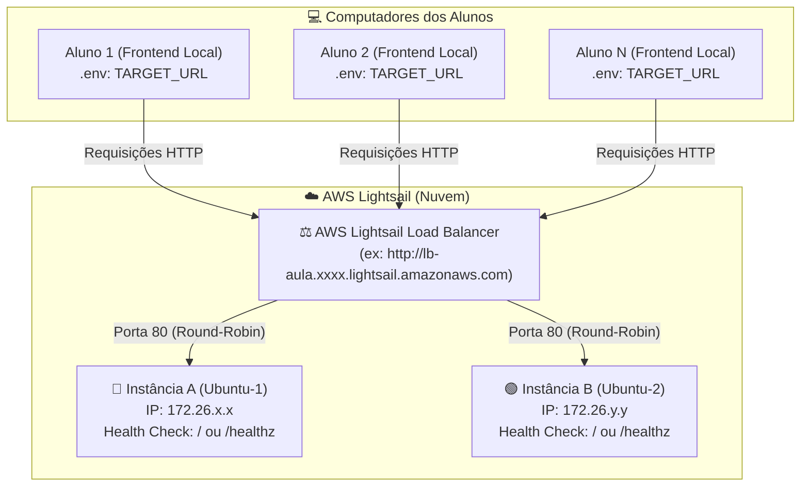

# 🚀 AWS Lightsail - Load Balancer & Failover Demo

Aplicação desenvolvida para aulas práticas e demonstrações de **Balanceamento de Carga (Load Balancing)**, **Health Checks** e **Alta Disponibilidade (Failover)** utilizando o **AWS Lightsail**.

---

## 📐 Arquitetura da Aula



> ⚠️ **REGRA DE OURO DO LIGHTSAIL LOAD BALANCER:**  
> O Load Balancer do AWS Lightsail **sempre** envia tráfego para as instâncias na **porta 80 (HTTP)**. Por isso, a aplicação nas instâncias da AWS precisa escutar diretamente na **porta 80**.

---

## 👨‍🏫 1. Guia do Professor: Como Configurar o Ambiente na AWS

O professor criará **2 Instâncias Ubuntu** e **1 Load Balancer** no console do AWS Lightsail.

---

### Passo 1.1: Criar a Instância A (Instância Matriz)
1. Acesse o console do [AWS Lightsail](https://lightsail.aws.amazon.com/).
2. Clique em **Create instance**.
3. Escolha a região (ex: `Virginia - us-east-1`).
4. Selecione a plataforma **Linux/Unix** e o blueprint **OS Only ➔ Ubuntu 22.04 LTS** (ou 24.04).
5. Escolha o plano de menor custo ($3.50 ou $5.00/mês).
6. Dê o nome de **`Ubuntu-1`** (ou `instancia-a`).
7. Clique em **Add launch script** (User Data) e cole o script abaixo para instalar tudo automaticamente:

#### 📜 Launch Script (User Data) para a **Instância A**:
```bash
#!/bin/bash
# 1. Atualizar pacotes e instalar Node.js 20 + Git
curl -fsSL https://deb.nodesource.com/setup_20.x | bash -
apt-get install -y nodejs git

# 2. Instalar PM2 globalmente
npm install -g pm2

# 3. Dar permissão para o Node.js usar a porta 80 nativamente
setcap 'cap_net_bind_service=+ep' $(which node)

# 4. Criar pasta e clonar o repositório
mkdir -p /opt/loadbalancer-app
cd /opt/loadbalancer-app
git clone https://github.com/jonathantecsantos/demostracao-loadbalancer-aws.git .

# 5. Criar o arquivo .env (Porta 80 obrigatória para o Lightsail Load Balancer!)
cat << 'EOF' > /opt/loadbalancer-app/.env
PORT=80
INSTANCE_NAME=Instância A - Lightsail
INSTANCE_COLOR=blue
EOF

# 6. Instalar dependências e iniciar com PM2
npm install
pm2 start server.js --name "loadbalancer-backend"

# 7. Configurar inicialização automática no boot do Linux (Essencial para testes de Stop/Start!)
sudo env PATH=$PATH:/usr/bin /usr/lib/node_modules/pm2/bin/pm2 startup systemd -u ubuntu --hp /home/ubuntu
pm2 save
```

8. Clique em **Create instance**.

> 💡 **Dica (Se você configurou a máquina manualmente via SSH):**  
> Caso configure via terminal SSH (`ubuntu`), certifique-se de rodar:
> ```bash
> pm2 startup
> # Copie e execute o comando "sudo env PATH=..." exibido na tela
> pm2 save
> ```
> Isso garante que, quando você desligar e ligar a máquina em aula para a demonstração de Failover, o Node.js suba sozinho no boot.

---

### Passo 1.2: Criar a Instância B (Instância Clone)
Para demonstrar o conceito de **Snapshots / Imagens de Disco** na nuvem:

1. No console do Lightsail, clique na **`Ubuntu-1`** e acesse a aba **Snapshots**.
2. Clique em **Create snapshot** (ex: `snapshot-instancia-a`).
3. Quando concluir, clique nos três pontinhos ao lado do snapshot e selecione **Create new instance**.
4. Dê o nome de **`Ubuntu-2`** (ou `instancia-b`) e crie a máquina.

#### 🔧 Ajustando as Variáveis da Instância B via SSH:
Como a Instância B é um clone exato, precisamos apenas mudar a cor, o nome e garantir a inicialização automática:

1. Na lista de instâncias do Lightsail, clique no ícone de terminal SSH (**`>_`**) da **`Ubuntu-2`**.
2. No terminal, execute:

```bash
# 1. Acessar a pasta da aplicação
cd /opt/loadbalancer-app

# 2. Atualizar o .env para a Instância B (Verde)
cat << 'EOF' > .env
PORT=80
INSTANCE_NAME=Instância B - Lightsail
INSTANCE_COLOR=green
EOF

# 3. Reiniciar o PM2 aplicando o novo .env e salvar o estado de boot
pm2 restart loadbalancer-backend --update-env
sudo env PATH=$PATH:/usr/bin /usr/lib/node_modules/pm2/bin/pm2 startup systemd -u ubuntu --hp /home/ubuntu
pm2 save
```

---

### Passo 1.3: Criar e Configurar o Lightsail Load Balancer
1. No menu superior do Lightsail, clique na aba **Networking** e em **Create load balancer**.
2. Escolha o nome do balanceador (ex: `lb-aula-demo`).
3. Clique em **Create load balancer**.
4. Acesse o Load Balancer criado:
   - Na aba **Inbound traffic**, na seção **Target instances**, anexe a **Ubuntu-1** e a **Ubuntu-2**.
   - Na seção **Health check**:
     - O caminho padrão **`/`** já funciona perfeitamente (retorna HTTP 200).
     - *(Opcional / Recomendado)*: Você pode alterar o **Health check path** para **`/healthz`** (resposta leve em JSON e ideal para testes de failover).
5. Na parte superior, copie o **DNS name** do Load Balancer (ex: `aa1dcc6e142140bfc447b7bd216f306f-721933512.us-east-1.elb.amazonaws.com`).
6. **Passe essa URL para os alunos com `http://` no início!** 📢  
   *Exemplo:* `http://aa1dcc6e142140bfc447b7bd216f306f-721933512.us-east-1.elb.amazonaws.com`

---

## 👩‍🎓 2. Guia do Aluno: Como Rodar a Aplicação Localmente

Cada aluno executará o frontend em seu próprio computador, apontando para o Load Balancer da AWS via `.env`.

### Passo 2.1: Clonar e Instalar as Dependências
Abra o terminal e execute:
```bash
# 1. Clonar o repositório
git clone https://github.com/jonathantecsantos/demostracao-loadbalancer-aws.git
cd demostracao-loadbalancer-aws

# 2. Instalar as dependências
npm install
```

### Passo 2.2: Configurar o arquivo `.env`
Crie o arquivo `.env` a partir do modelo:

**No Windows (PowerShell):**
```powershell
Copy-Item .env.example .env
```

**No Linux / macOS (Bash):**
```bash
cp .env.example .env
```

Abra o `.env` e configure o `TARGET_URL` com a URL do Load Balancer fornecida pelo professor:

```env
PORT=3000
TARGET_URL=http://aa1dcc6e142140bfc447b7bd216f306f-721933512.us-east-1.elb.amazonaws.com
```

> ⚠️ **Atenção:** Sempre inclua o `http://` no início da URL. O Load Balancer escuta na porta 80 padrão, portanto **não** adicione `:3000` no final da URL do balanceador.

### Passo 2.3: Iniciar o Servidor Local
```bash
npm start
```

Abra no navegador: **[http://localhost:3000](http://localhost:3000)**

---

## 🧪 3. Roteiro Prático da Demonstração em Aula

### 1️⃣ Testando o Balanceamento de Carga (Round-Robin)
1. Com o painel aberto em `http://localhost:3000`, clique repetidamente no botão **"Fazer Nova Requisição"** ou marque o checkbox **"Auto-Refresh"**.
2. **O que observar**:
   - As respostas vão alternar entre **Instância A** (Card Azul) e **Instância B** (Card Verde).
   - O endereço IP interno de cada máquina da AWS mudará em tempo real.
   - O gráfico de **Distribuição em Tempo Real** mostrará o tráfego sendo dividido uniformemente (~50% para cada nó).

---

### 2️⃣ Testando a Tolerância a Falhas e Alta Disponibilidade (Failover)
1. O professor acessa o console do AWS Lightsail e clica em **Stop (Parar)** na **Ubuntu-1** (ou na **Ubuntu-2**).
2. Os alunos continuam clicando no painel ou mantêm o **Auto-Refresh** ativado.
3. **O que acontece**:
   - O Load Balancer da AWS detecta a indisponibilidade da máquina e para de encaminhar tráfego para ela.
   - O Load Balancer desvia **100% das novas requisições para a outra instância saudável**.
   - Os alunos observam que o sistema **permanece online sem nenhuma interrupção** para os usuários finais!
4. O professor clica em **Start (Iniciar)** na máquina parada.
   - **Tempo de recuperação:** A AWS leva cerca de **60 a 90 segundos** para executar checagens de integridade consecutivas bem-sucedidas.
   - **Recuperação automática:** Assim que o status na AWS voltar para **Healthy**, as requisições voltam a se equilibrar entre Azul e Verde **automaticamente**, sem precisar reiniciar o servidor local dos alunos (`npm start`) nem atualizar a página!

> ⚠️ **Atenção no Teste de Aula (Se a máquina voltar com "Health Check: Failed"):**  
> Se o serviço do systemd não foi habilitado antes do Stop, o Node.js não iniciará sozinho com o boot do Ubuntu. Para resolver em segundos:
> 1. Clique no ícone de terminal SSH (**`>_`**) da máquina que foi reiniciada.
> 2. No terminal, reative o processo e garanta que ele nunca mais esqueça no boot:
>    ```bash
>    cd /opt/loadbalancer-app
>    pm2 start server.js --name "loadbalancer-backend" || pm2 resurrect
>    sudo env PATH=$PATH:/usr/bin /usr/lib/node_modules/pm2/bin/pm2 startup systemd -u ubuntu --hp /home/ubuntu
>    pm2 save
>    ```

---

## 🛠️ 4. Solução de Problemas Comuns (Troubleshooting)

| Sintoma / Erro | Causa Mais Provável | Como Resolver |
| :--- | :--- | :--- |
| `Health Check: Failed` no painel do Lightsail | A aplicação não está escutando na porta 80 ou o PM2 não foi iniciado na instância | No terminal SSH da máquina, verifique `pm2 status` e rode `curl -I http://localhost:80/`. Certifique-se de que o `.env` na AWS está com `PORT=80`. |
| `Health Check: Failed` após dar **Stop/Start** na instância | O Node.js/PM2 não foi configurado para subir no boot do Linux | Acesse via SSH e execute: `cd /opt/loadbalancer-app && pm2 start server.js --name "loadbalancer-backend" && pm2 save`. Em seguida, configure o boot com `sudo env PATH=$PATH:/usr/bin /usr/lib/node_modules/pm2/bin/pm2 startup systemd -u ubuntu --hp /home/ubuntu && pm2 save`. |
| `Failed to parse URL from ...` no terminal do aluno | A variável `TARGET_URL` no `.env` foi informada sem o protocolo (`http://`) | Edite o `.env` local e garanta que começa com `http://` (ex: `TARGET_URL=http://lb-demo...`). |
| `502 Bad Gateway` retornado pelo Load Balancer | Todas as instâncias anexadas estão indisponíveis ou falharam no Health Check | Verifique se as instâncias no Lightsail estão anexadas e com status **Healthy**. |
| `Connection refused` ao testar `curl http://localhost:80/` | Node.js sem permissão para porta 80 no Linux | Execute `sudo setcap 'cap_net_bind_service=+ep' $(which node)` e reinicie a aplicação com `pm2 restart all`. |

---

## 📡 5. Tabela de Endpoints

| Endpoint | Método | Descrição |
| :--- | :--- | :--- |
| `/` | `GET` | Interface visual completa do aluno (HTML/CSS/JS) |
| `/api/config` | `GET` | Retorna o modo de execução (Proxy ou Local) e a URL alvo configurada |
| `/api/info` | `GET` | Repassa a requisição ao Load Balancer e traz os dados da instância atendente |
| `/healthz` | `GET` | Endpoint JSON leve de monitoramento de integridade para a AWS |

---

## ⚙️ 6. Variáveis de Ambiente (`.env`)

| Variável | Descrição | Onde Configurar | Valor Típico |
| :--- | :--- | :--- | :--- |
| `PORT` | Porta onde a aplicação escuta | **AWS (Instâncias)** | `80` |
| `PORT` | Porta do servidor web local | **Aluno (Computador)** | `3000` |
| `TARGET_URL` | URL HTTP completa do Load Balancer AWS | **Aluno (Computador)** | `http://lb-aula.xxxx.lightsail.amazonaws.com` |
| `INSTANCE_NAME`| Nome amigável exibido no card | **AWS (Instâncias)** | `Instância A - Lightsail` |
| `INSTANCE_COLOR`| Cor temática (`blue`, `green`, `purple`, etc.) | **AWS (Instâncias)** | `blue` ou `green` |
