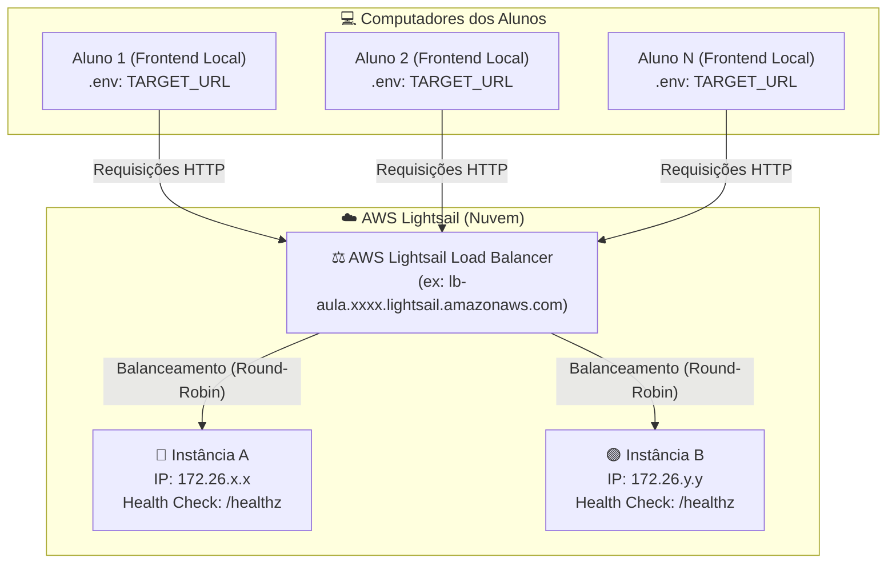

# 🚀 AWS Lightsail - Load Balancer & Failover Demo

Aplicação desenvolvida para aulas práticas e demonstrações de **Balanceamento de Carga (Load Balancing)**, **Health Checks** e **Alta Disponibilidade (Failover)** utilizando o **AWS Lightsail**.

---

## 📐 Arquitetura da Aula



---

## 👨‍🏫 1. Guia do Professor: Como Configurar o Ambiente na AWS

O professor criará **2 Instâncias** e **1 Load Balancer** no AWS Lightsail.

### Passo 1.1: Criar a Instância A (Instância Matriz)
1. Acesse o console do [AWS Lightsail](https://lightsail.aws.amazon.com/).
2. Clique em **Create instance**.
3. Selecione a plataforma **Linux/Unix** e o blueprint **OS Only ➔ Ubuntu 22.04 LTS** (ou 24.04).
4. Escolha o plano mais simples ($3.50 ou $5.00/mês) e dê o nome de **`instancia-a`**.
5. Clique em **Add launch script** (User Data) e cole o script abaixo para inicializar a aplicação automaticamente gravando o arquivo `.env`:

#### 📜 Launch Script (User Data) para a **Instância A**:
```bash
#!/bin/bash
# 1. Atualizar pacotes e instalar Node.js 20 + Git
curl -fsSL https://deb.nodesource.com/setup_20.x | bash -
apt-get install -y nodejs git

# 2. Instalar PM2 globalmente
npm install -g pm2

# 3. Criar pasta e clonar o repositório
mkdir -p /opt/loadbalancer-app
cd /opt/loadbalancer-app
git clone https://github.com/jonathantecsantos/demostracao-loadbalancer-aws.git .

# 4. Criar o arquivo .env da Instância A
cat << 'EOF' > /opt/loadbalancer-app/.env
PORT=3000
INSTANCE_NAME=Instância A - Lightsail
INSTANCE_COLOR=blue
EOF

# 5. Instalar dependências e iniciar com PM2
npm install
pm2 start server.js --name "loadbalancer-backend"
pm2 startup
pm2 save
```

---

### Passo 1.2: Criar a Instância B via Snapshot (Demonstração Prática)
Para demonstrar o conceito de **Snapshots / Imagens de Disco** na nuvem:

1. No console do Lightsail, entre na **`instancia-a`** e vá na aba **Snapshots**.
2. Clique em **Create snapshot** (dê um nome, ex: `snapshot-instancia-a`).
3. Após o snapshot ser concluído, clique nos três pontinhos ao lado dele e selecione **Create new instance**.
4. Dê o nome de **`instancia-b`** e crie a máquina.

#### 🔧 Ajustando as Variáveis da Instância B via SSH:
Como a Instância B é um clone exato, ela herdará as configurações da Instância A. Para personalizá-la como **Instância B (Verde)**:

1. Na lista de instâncias do Lightsail, clique no ícone de terminal **"Connect using SSH"** (ou `_>`) da **`instancia-b`**.
2. No terminal aberto, execute os seguintes comandos:

```bash
# 1. Acessar a pasta da aplicação
cd /opt/loadbalancer-app

# 2. Atualizar o arquivo .env para a Instância B
cat << 'EOF' > .env
PORT=3000
INSTANCE_NAME=Instância B - Lightsail
INSTANCE_COLOR=green
EOF

# 3. Reiniciar o PM2 aplicando as novas variáveis do .env
pm2 restart loadbalancer-backend --update-env
pm2 save
```
> **Nota:** O IP é detectado automaticamente pelo Node.js em tempo de execução, portanto a Instância B exibirá seu próprio IP da AWS imediatamente!

---

### Passo 1.2: Liberar o Firewall das Instâncias
1. Na aba **Networking** de cada instância criada, vá até a seção **Firewall**.
2. Clique em **Add rule**:
   - **Application**: Custom
   - **Protocol**: TCP
   - **Port**: `3000` (ou a porta escolhida)
3. Clique em **Create**.

---

### Passo 1.3: Criar e Configurar o Lightsail Load Balancer
1. No menu superior do Lightsail, clique na aba **Networking** e em **Create load balancer**.
2. Escolha o nome para o balanceador (ex: `lb-aula-demo`).
3. Após criado, acesse o Load Balancer:
   - Na aba **Inbound traffic**, em **Target instances**, anexe a **Instância A** e a **Instância B**.
   - Na seção **Health check**:
     - **Health check path**: Altere para `/healthz`
4. Na parte superior, copie o **DNS name** do Load Balancer (ex: `http://lb-aula-demo.xxxxxx.lightsail.amazonaws.com`).
5. **Passe essa URL para os alunos!** 📢

---

## 👩‍🎓 2. Guia do Aluno: Como Rodar a Aplicação Localmente

Cada aluno executará a aplicação no seu próprio computador e a apontará diretamente para a nuvem através do arquivo `.env`.

### Passo 2.1: Clonar e Instalar as Dependências
Abra o terminal no seu computador e execute:
```bash
# 1. Clonar o repositório
git clone https://github.com/jonathantecsantos/demostracao-loadbalancer-aws.git
cd demostracao-loadbalancer-aws

# 2. Instalar as dependências
npm install
```

### Passo 2.2: Configurar o arquivo `.env` com o Load Balancer da Aula
Crie o arquivo `.env` copiando o modelo de exemplo:

**No Windows (PowerShell):**
```powershell
Copy-Item .env.example .env
```

**No Linux / macOS (Bash):**
```bash
cp .env.example .env
```

Abra o arquivo `.env` no seu editor de código (ex: VS Code) e preencha a variável `TARGET_URL` com a URL do Load Balancer fornecida pelo professor:

```env
PORT=3000
TARGET_URL=http://lb-aula-demo.xxxxxx.lightsail.amazonaws.com:3000
```
> *(Obs: Se o Load Balancer estiver na porta padrão 80, não é necessário colocar `:3000` no final).*

### Passo 2.3: Iniciar o Frontend Local
No terminal, execute:
```bash
npm start
```

Abra no seu navegador: **[http://localhost:3000](http://localhost:3000)**

---

## 🧪 3. Roteiro Prático da Demonstração em Aula

### 1️⃣ Testando o Balanceamento de Carga (Round-Robin)
1. Com a página aberta em `http://localhost:3000`, clique repetidamente no botão **"Fazer Nova Requisição"** ou marque o checkbox **"Auto-Refresh"**.
2. **O que observar**:
   - As respostas irão alternar entre **Instância A** (Card Azul) e **Instância B** (Card Verde).
   - O endereço IP interno de cada máquina mudará na tela.
   - O gráfico de **Distribuição em Tempo Real** mostrará o tráfego sendo dividido em aproximadamente 50% para cada nó.

---

### 2️⃣ Testando a Alta Disponibilidade e Tolerância a Falhas (Failover)
1. O professor acessa o console do AWS Lightsail e clica em **Stop (Parar)** na **Instância A**.
2. Os alunos continuam clicando ou mantêm o **Auto-Refresh** ligado.
3. **O que acontece**:
   - O Load Balancer da AWS percebe que o Health Check (`/healthz`) da Instância A parou de responder.
   - O Load Balancer automaticamente desvia **100% das novas requisições para a Instância B** (Verde).
   - Os alunos percebem que o sistema **não sai do ar** e continua respondendo normalmente!
4. O professor clica em **Start (Iniciar)** na Instância A.
   - Assim que o Health Check voltar a responder `200 OK`, o Load Balancer reintroduz a Instância A no pool e o tráfego volta a ser balanceado entre Azul e Verde!

---

## 📡 4. Tabela de Endpoints Disponíveis

| Endpoint | Método | Descrição |
| :--- | :--- | :--- |
| `/` | `GET` | Interface visual do aluno (HTML/CSS/JS) |
| `/api/config` | `GET` | Retorna o status de conexão e a URL alvo configurada no `.env` |
| `/api/info` | `GET` | Repassa a chamada para o Load Balancer e traz os dados da instância ativa |
| `/healthz` | `GET` | Endpoint de monitoramento de saúde para o AWS Lightsail |

---

## ⚙️ 5. Variáveis de Ambiente (`.env`)

| Variável | Descrição | Onde Configurar | Exemplo |
| :--- | :--- | :--- | :--- |
| `TARGET_URL` | URL/DNS do Load Balancer AWS para onde o frontend local envia requisições | **Máquina do Aluno** | `http://lb-demo.lightsail.amazonaws.com:3000` |
| `PORT` | Porta do servidor web local | **Aluno & AWS** | `3000` |
| `INSTANCE_NAME`| Nome de identificação da instância | **Instância AWS** | `Instância A - Lightsail` |
| `INSTANCE_COLOR`| Cor temática (`blue`, `green`, `purple`, etc.) | **Instância AWS** | `blue` |
